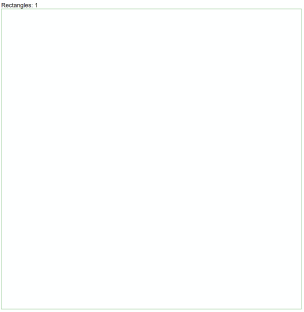
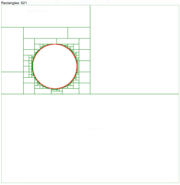
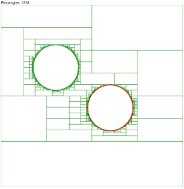
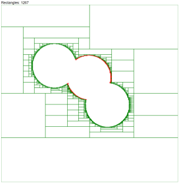

# Destructible Terrain

A javascript rectangle break approach on circle(explosion) colision with terrain.

The code includes an interactive demo page.

The perfection of contour is defined by the smaller rectangle allowed.
The Area parameter defines the smaller rectangle that can be created. 

Play with it [here](https://nxtthing.blob.core.windows.net/github/destructible-terrain/index.html). Click on the image to destroy the terrain.

